# :snake: zpp_serpent
# Informations
Implémentation de l'algorithme de chiffrement Serpent en python3, basé sur le travail de Frank Stajano<br>
Chiffrement de bloc de 128bits avec une clés de 256bits<br>
Remplissage de bloc incomplet avec utilisation du padding RFC2040 ou CipherText Stealing (pour ECB et CBC) <br>
Fonctionnement possible en ECB, CBC, PCBC et CFB<br>
Hashage du mot de passe et du vecteur d'initialisation en pbkdf2_hmac sha256 avec un salt aléatoire<br>
## <ins>Prérequis</ins>
- Python 3
- Module Python 3:
   - bitstring
<br>

# Installation
```console
pip install zpp_serpent
```

# Utilisation
## <ins>_Electronic codebook (ECB)_</ins>
### Fonctionnement
<kbd>
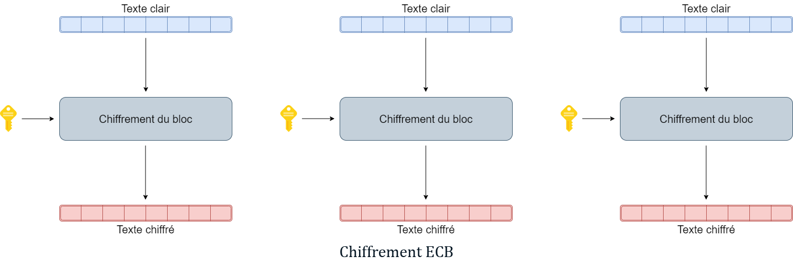
</kbd>
<br>
<br>
<kbd>
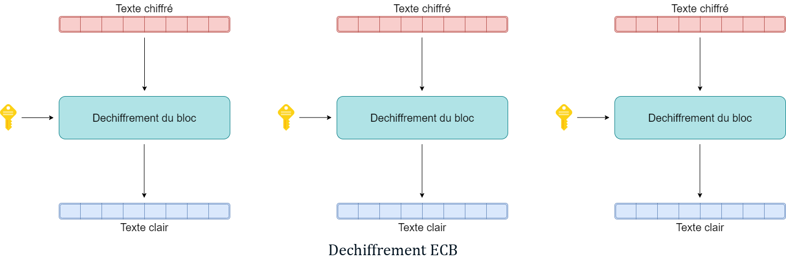
</kbd>

### Chiffrement
```python
encrypted = zpp_serpent.encrypt_ECB(cleartext, password)
```
### Dechiffrement
```python
plain = zpp_serpent.decrypt_ECB(encrypted,password)
```
<br>

>En paramètre supplémentaire, nous pouvons mettre:<br/>
>- hash_type = pour choisir l'algorithme de hashage utilisé pour la clé
>- lvl = 1 (pour padding RFC2040) ou 2 (pour CTS)
<br>

## <ins>_Cipher block chaining (CBC)_</ins>
### Fonctionnement
<kbd>
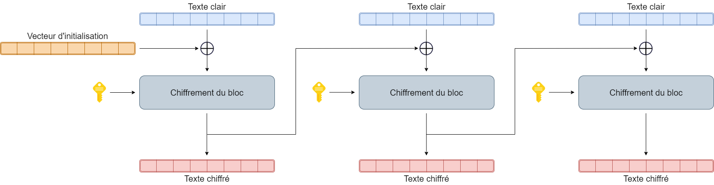
</kbd>
<br>
<br>
<kbd>

</kbd>

### Chiffrement
```python
encrypted = zpp_serpent.encrypt_CBC(cleartext, password)
```
### Dechiffrement
```python
plain = zpp_serpent.decrypt_CBC(encrypted, password)
```
<br>

>En paramètre supplémentaire, nous pouvons mettre:<br/>
>- hash_type = pour choisir l'algorithme de hashage utilisé pour la clé
>- lvl = 1 (pour padding RFC2040) ou 2 (pour CTS)
<br>

## <ins>_Propagating cipher block chaining (PCBC)_</ins>
### Fonctionnement
<kbd>
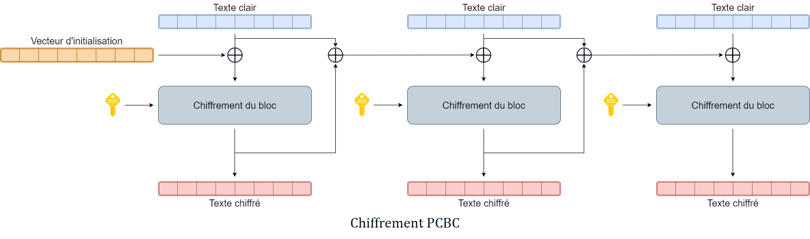
</kbd>
<br>
<br>
<kbd>
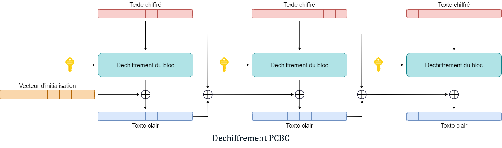
</kbd>

### Chiffrement
```python
encrypted = zpp_serpent.encrypt_PCBC(cleartext, password)
```
### Dechiffrement
```python
plain = zpp_serpent.decrypt_PCBC(encrypted, password)
```
<br>

>En paramètre supplémentaire, nous pouvons mettre:<br/>
>- hash_type = pour choisir l'algorithme de hashage utilisé pour la clé
<br>

## <ins>_Cipher feedback (CFB)_</ins>
### Fonctionnement
<kbd>
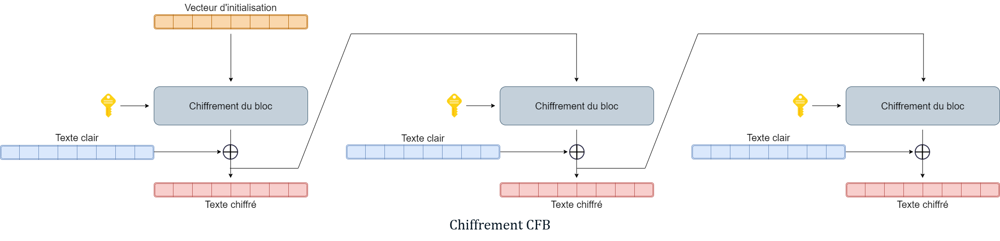
</kbd>
<br>
<br>
<kbd>
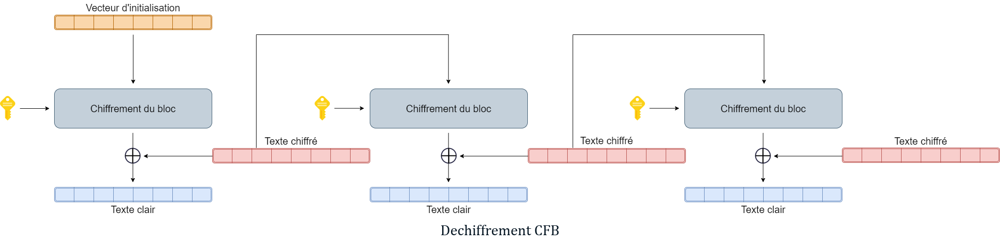
</kbd>

### Chiffrement
```python
encrypted = zpp_serpent.encrypt_CFB(cleartext, password)
```
### Dechiffrement
```python
plain = zpp_
serpent.decrypt_CFB(encrypted, password)
```
<br>

>En paramètre supplémentaire, nous pouvons mettre:<br/>
>- hash_type = pour choisir l'algorithme de hashage utilisé pour la clé
<br>

# Technique de remplissage
## <ins>_Padding RFC2040_</ins>
La méthode padding RFC2040 est une technique largement utilisé pour le remplissage de bloc imcomplet.
Elle se base sur un modèle qui varie en fonction de la taille d'un bloc à remplir.

Supposons qu'un bloc ne fasse que 112bits au lieu des 128bits nécessaire. Il faut donc trouver une méthode de combler le vide avec une modèle qui pourra être retiré lors du déchiffrement. 
Avec cette méthode, nous allons remplir la fin du bloc par autant d'octet que nécessaire, avec pour valeur le nombre d'octet que nous devons rajouter.
Dans notre exemple, il nous manque 2 octets pour arriver à 128bits. Nous devons donc ajouter à la fin du bloc 2 Octets avec la valeur hexadécimal 02 pour remplir complètement ce bloc.

<kbd>
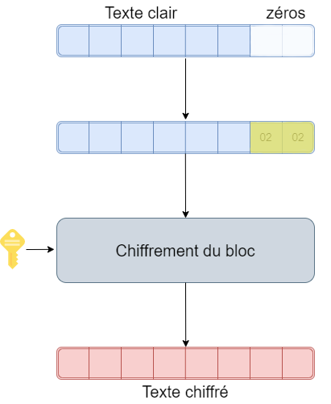
</kbd>
<br>
<br>

Pour le déchiffrement, nous allons analyser les modèles en fin de bloc pour déterminer si ce sont des blocs qui ont été rajoutés et qui doivent être enlevés.

<kbd>
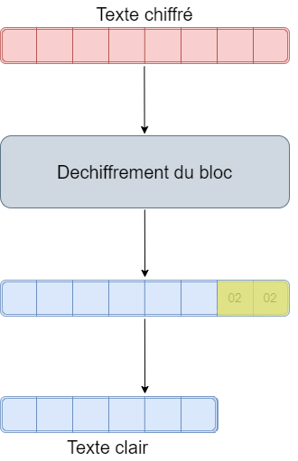
</kbd>

## <ins>_CipherText Stealing (CTS)_</ins>
La méthode de vol de texte chiffré (CipherText Stealing) permet le remplissage de bloc incomplet tout en évitant d'augmenter la taille du texte comme peu le faire le padding RFC2040. 
De plus, elle limite les attaques dit Padding oracle attack qui est la faiblesse du padding RFC2040 sur du chiffrement ECB et CBC.
Cette méthode se base sur le traitement des deux derniers blocs d'un message et sur le double chiffrement d'une partie d'un des deux blocs.

### ECB
<kbd>
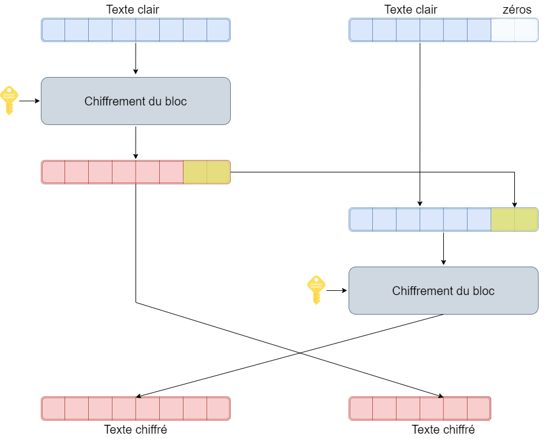
</kbd>
<br>
<br>
<kbd>
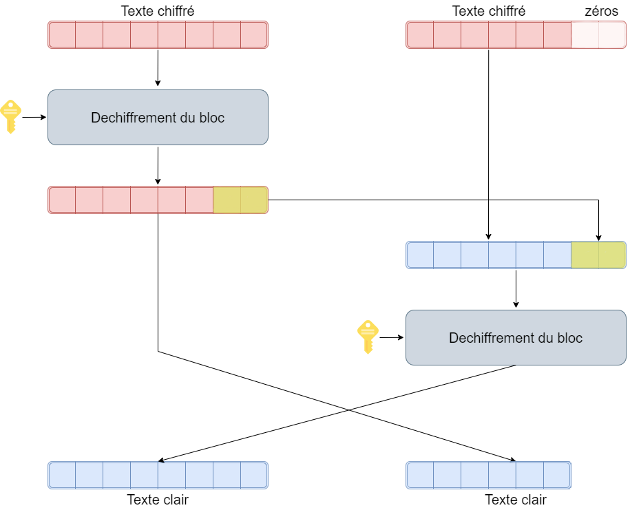
</kbd>

### CBC
<kbd>
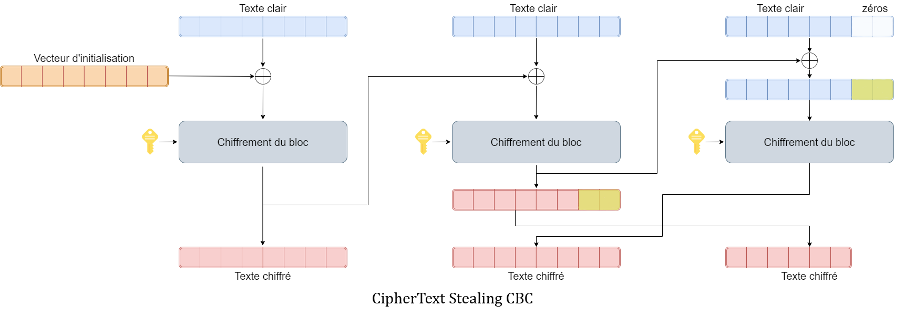
</kbd>
<br>
<br>
<kbd>
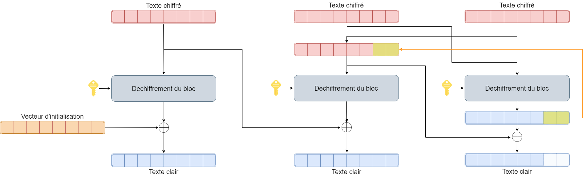
</kbd>